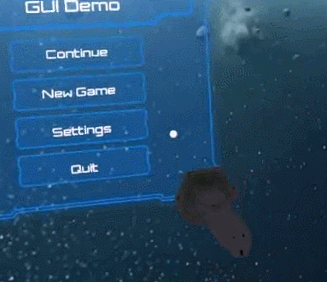
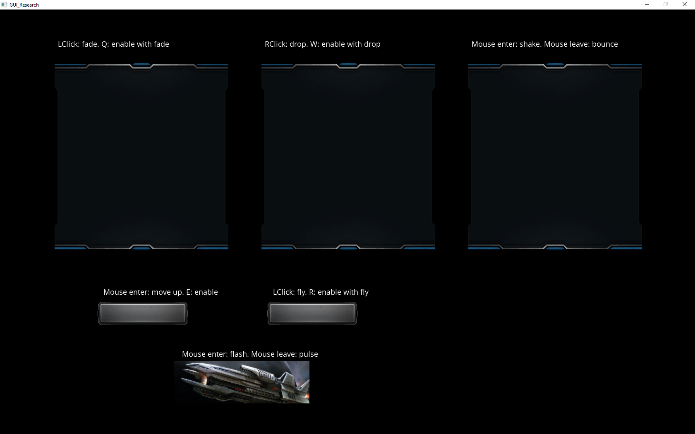
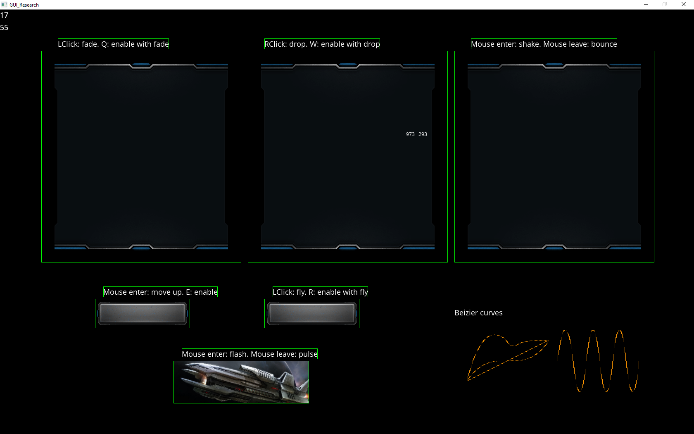
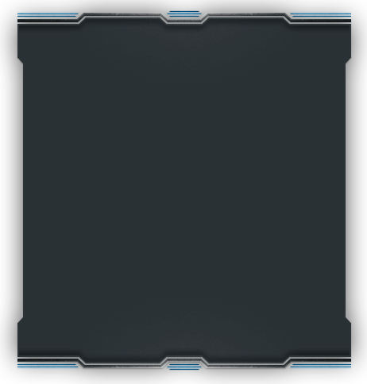
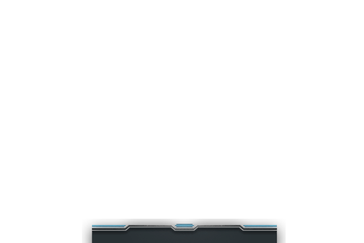
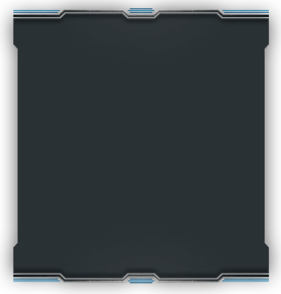

# GUI_Research

<p>Visit counts</p>
<script type="text/javascript" src="https://counter8.fcs.ovh/private/counter.js?c=36bs8mbcn7pedcxy6tmq539nqd96xnu6"></script>
<noscript><a href="https://www.freecounterstat.com" title="website counter"></a></noscript>

Index
<ul>
<li> <a href="#UI_D_D">UI-Data driven. </a></li>
<ol>
<li> <a href="#UI_D_D_Intro">Intro </a></li>
<li> <a href="#UI_D_D_UML">UML </a></li>
<li> <a href="#UI_D_D_Explanation">Explanation</a></li>
<li> <a href="#UI_D_D_How">How do we achieve this?</a></li>
<li> <a href="#UI_D_D_Try">Try it for yourself!</a></li>
</ol>
<li><a href="#UI_A_T">UI-Animations and transitions.</a></li>
<ol>
<li> <a href="#UI_A_T_Intro">Introduction</a></li>
<li> <a href="#UI_A_T_SvsT">Static animations vs. transitions</a></li>
<li> <a href="#UI_A_T_IntroSys">Introduction to the system</a></li>
<li> <a href="#UI_A_T_Goal">Goal</a></li>
<li> <a href="#UI_A_T_Start">Let's start</a></li>
<li> <a href="#UI_A_T_aboutMethods">About methods</a></li>
<li> <a href="#UI_A_T_bezier">Bezier curve</a></li>
<li> <a href="#UI_A_T_Todos">Let's do some work!!! TODOs</a></li>
</ol>
</ul>


<h1 id="UI_D_D"> UI-Data driven. </h1>
<p>Download the source code <a href="https://github.com/GUI-Research/GUI_Research/archive/D_D_UI_v0.1.1.zip">here</a> with the solution folder and the TODO's folder.</p>
<p>Download the release solution <a href="https://github.com/GUI-Research/GUI_Research/releases/download/D_D_UI_v0.1.1/Game_Release_v0.1.zip">here</a>.</p>

<h2 id="UI_D_D_Intro">Data driven UI introduction</h2>
<p>First things first. This is a simple UI project to teach the basis of what is a data driven UI</p>
<p>This UI consists about two big parts. The first is the "M_GUI" a module that handles the UI, and by the other side, exists a cloud of elements. Each element is a piece of UI.</p>

<h2 id="UI_D_D_UML">UI UML</h2>
<div class="mxgraph" style="max-width:100%;border:1px solid transparent;" data-mxgraph="{&quot;highlight&quot;:&quot;#0000ff&quot;,&quot;nav&quot;:true,&quot;resize&quot;:true,&quot;toolbar&quot;:&quot;zoom layers lightbox&quot;,&quot;edit&quot;:&quot;_blank&quot;,&quot;xml&quot;:&quot;&lt;mxfile userAgent=\&quot;Mozilla/5.0 (Windows NT 10.0; Win64; x64) AppleWebKit/537.36 (KHTML, like Gecko) Chrome/56.0.2924.87 Safari/537.36\&quot; version=\&quot;6.4.2\&quot; editor=\&quot;www.draw.io\&quot; type=\&quot;google\&quot;&gt;&lt;diagram name=\&quot;Page-1\&quot;&gt;7V1bk5s6Ev41rpqTKqe4+vI49kxyUuvMSWWSPbtPLhlkmzMYuUCeS379tpDAXGQbMGBPltRUDEJIre5Wq/tTAz19unn97KPt+iuxsdvTFPu1p9/1NE0zFQN+WMkbL1HHoxEvWfmOLcr2BY/OLywKFVG6c2wcpCpSQlzqbNOFFvE8bNFUGfJ98pKutiRuutctWuFcwaOF3Hzp345N17x0pA325X9iZ7WOelYHY35lgaynlU92nuivp+nL8B+/vEFRW2KgwRrZ5CVRpN/39KlPCOVHm9cpdhlzI7bx+z4duBrT7WOPFrnBGJkwqtHSWCzG6tAY9k0hqGfk7nA0hpBS+hZxB9vALHFKfLomK+Ih935fOgk5gFkfCpyt6caFQxUOgSz/7T+s/KMZnf5XVAso8uktkx4UeMTDUdknx3VFHezZmRpQkr4utEkdwek/mNI3UYB2lEDRnuAZIVtBVkB98hSLGqQwWRKPRi0ZcM6ZwEZ+kNOiKCA738KH2CuUGfkrTA/UUcexIsAMw2SDgUlwk49dRJ3nNAFIaPoqrreXNhwIgRcVfk72X+eff37JKUDw4mxcFLI/IduQZaISO0eus/Lg2AIOYR8KnrFPHZhkt+ICZfyfWGvHtWfojewYQ0Dg1lN0NlkT3/kFzSI3FhTog5ALzMZkjUd2p1ADHwdQ51skHDUumqGAijoWcV20DZxFTPAGpOJ4E0Ip2UQ6KUbKVGxKXOKHDIjmdF5Nlul6tolHthErWOLKSFvog0GsWIw1+PW4auU1QtzQN0xhToS97evi/GVvvIaGKFsnDJcxVEqrEVn8w0yuprhogV3RIZw+3s3mP/Ar3fn4Q0+/7WkDl4kw2CIPjlc0HOsAbZjMvUXAfhB1oWNREbrJ1A2Lbec5W5Ss1s+2eaK5ZFlAbUaofrtB27gZN3UF5OZ4q54GTFBgJty7eANC+RDX5m2z0bI16xsoGaanRgTFkkGdHqeygCWQ9wWU2A4NKVNCCShL5Ab43I77YpQzMcqwrw3ZBfhPAhpaph25UJJU5TpaEmvXCO96WiWtcB2wFSm1OK0BM37PmUM4gwYbL3arzzlCUs1raW1NLPIHV4ZBwgCJVSSxHoDpoum1IGfvBtYIL5YSC4nwaGklVgsXL+nBtQL4aYHWz8I6d8a+5LuwaazoZe1Q/AjljLoX8FDZqg/tLd3Qb1g7to290EmhiCJu/pmt3xLH4+wwJ/AHlnHKvBTzjk1/c6Luz+GPVffplHgwUuSEdhrD2vKC2fpywHs4YeTly3He6gsjHzmjp2y8qhmlbTycCjNf0HMYnvYaXSfrMKS9LjWjHMK/O6EXG5Bm6HIKRfgR+nR9Nacsel5ZdIkShIvaNxKAdSWsfZ/XzSjHNchfNQsu8qMGPEVZlCAzZLcv6AnfbHcrh9uz14079yBejE0X//+PcB27jda4EpbykTmEN9XvByP4c2sjim/APCDm1tg0bu30IrYL752DW0rrWLsmclqyhFyGNpgV9Ip4JXUvJWTPCBLhxU0JYjN6VJzGAh7GAU1Gz7hFOk/7TF+Rh1b4/hkMVJCYYc8ErMLFvTQw3Mi2wOKG9P0gzN/BHvaDm5SDpGB+yD14cHrmOBwPu8IOWhnWnY9e2mEg6+mOeYAlONkQZWnl/uR4tpDKTSXnFsLNsPY0dCoy0ZnioQ0uMWnS3ZxrF2sdm1R75cubjN6FX9AeFZajtMWTPJHROPUx2P/JjlLiffLJhscfN58n8+/gaSJv5eI0x5hbleXUfBv5ZgdUYRu2ekxR+DWLuW7sd418xup5GMRE4bS3c90t9U/oVIHZBfLkI65B04quJJzRM+bJnsfd0BmeM9yMXeO/bfA1w8BwJNX4V3U1PszWLxtYFC+pvuV4F5JbmXf1mogmNP9yBq9ZC9oIZzMReQHYxh4sBiaDqZc5AFyzOtimUtg+Kha266rWQOCujnOR+97l6DZ6rnyjRzfSGz3GOA8CmppMmQb1bPRIbFVf0J9Z4i/ijfdDHQuK913NXz+TSPq2xTG7WEzKCgJOB/Q6//nwr4e//n4oPop9G+eS5nOJF5VcGd/nTMqCMDsj3u76xqz+jfpxyV0lOCjhF/G7zybJJUBTjBVHpDmcNIUTppQgy6mHrAhgK9qt0PLHWnG5lIEIfdqHMEQoPTEj3/dMpnit914NKdHdCMiqxYh9JfbOxXUYsBp91gr7j4nkqG4DsjVP9lAm0uEdSKnzoQ5a2IGMBtRtQbaoAeo4vwcpVYEm9iAjAUs2IU9jZM+OT3eItf+XJza1IuQqDcEm01+S+Fa6lshdYRUke2NZYP0k1LSnLt47iPo9u0G2PVBTq9M1tp6+eNsdPZ95lZl1fLiP2Hdg/v6Sb0IrLNO2hIdWzwZJShpBCQILsKYiw25tO9pBu4l9BhAfO/pB4Gp1Xf6ON6AAR1rnFRoZZFH8rACK2GFnV7He5MGzAy5HE+CZlk9zygRPHX52zfgZtJaGz4bDnDrpkVuRgs+0xuAzudG0fbRaiYnay2T3puzSWZuT9SSPMLAH+8iKn024cnIt5H0K3bV3QGuSq9TflYAwaiIg9OC+eIFjp2XbMhnu1HWsJ2wnaWiVAF9CQNtM4MDedI28VduENJwuQrxZyN+fWz6s+3/fP/yYP/z1cF8OBI+Su85mdUTQHXnx8iTVbSxqJv37QV6+C8LfJc8/g0ecWFXeEeUzQgL8Pkn/yhane+Z9vFPaZxg943dGe5Mo/6hD+duPuXlUWwbll8ZI2rgFlF/XcxF49Nj1MT0JY9qDMmBsZk+HB4KVJdVE4P1GWiC6WlQgJ2JWLZ3yMdDykLsMAakQsRZgf/4J8Rz3z3g7QB1vALi6R/6jvY+jz/yn9jdbfeZfH+RE+uH3nlF9VclkUQ0vOKXMfELeBafUwiUMG7y2t2qcMTHErSK1Zq8DqvFxMBoPTFMdaoaqD7WUSowHxsdx4l9m/5JPeNHmXviluxmZZrphbiRyDYN40Fuimphtx4Znpjsam6cIPXoDHHAa9koeC6Oi3clj6VG6ek7/Oxj9qmD0vjZIG9CxmvcRtZFsW8ZoE0fvB3BjlJp3dQmN4uUnRUlLvV7lwhBehdBO70K7C4R2eunQTjptjTYiuwJ+UJe/VbMCyBxfmQI0kb4VLQVV0rdkkFpNOU2FEoYqtVww1+dSOTBdxss1muhhPuFFOkMbyXcx89hAF5uWhH+M6P2lR+EfrY4ot0KUaKT9eEXJ6EvNQZ+RT9KOnu/ugr7rDvr0dMg3kmR+x+5EOhOv1ZCP8hCpxbgq23vxrut+xsldPPJXNRTsP/l6h3cXUBpJk9kFlC15K8YBI3EkoJQZBbOFgNLIbxV2AWXTCjAquCo0ElAajQaU5RI8yjx30lQkecEHKrpg8hrN80gSTMpmZ7RLVW8wWeABzS53ICPPIt8LSHlCrQWPeiYgUJVR5lMTJ24YiwW6sWDTlK0HV4Ze1KdxGRykTQW8EHphDI+iF9cAd+TTpeL3AeZUscM7rgrv6Jvj7Ca3xLcdS9OEWn5YzOFJE0p4W6X3L53xlsDMczocyjuDlDNe9ljb4ygwITx78vYYpQ+cJvzMl4S2l3YAo1sz1/Y3HZvFn9L6bUZ3YYxtkDCRHcbWVhBX+rsf0mVIVdoA2boPf7SvAark815SFWgEZTv86Y9a0jYKWuya3lV/CqdjP380TsRJPE+Q0eF53VKQNgQSQE9mCJrJDpElcNWHr+w/FdpLfig0/G7o7wn2DQpgLak82nY/DqrlxP2bP3rX1zMPCo0lSQ+6ZLpVyHIvwP//u0cfc/xXleG4KQHA6f6zyxz823/cWr//Hw==&lt;/diagram&gt;&lt;/mxfile&gt;&quot;}"></div>
<script type="text/javascript" src="https://www.draw.io/js/viewer.min.js"></script>
<link rel="stylesheet" href="highlight/styles/darkula.css">
<script src="highlight/highlight.pack.js"></script>
<script>hljs.initHighlightingOnLoad();</script>

<p>This UML is about important elements to use the UI and extend its functionality, not all the internal methods and attributes are listed, only the needed ones about the subject.
When you implement this project in your own, try to extend elements functionality, this project only has Label, Image and Button.
You should implement a good event handler too. This should make things much more easier.
</p>

<h2 id="UI_D_D_Explanation">Explanation</h2>
<p>Now we know what this project has, so lets get into the sauce and learn what a Data driven system is.</p>
<p>A data driven system its a system that moves around data.</p>
<p><b>Which data?</b></p>
<p>Any data.</p>
<p>For us, moving around data means that our UI its gonna be based on a permanent data stored in the hard disk. This will allow us
to load te UI layout without coding it inside our project. </p><p><b>YOU DONT NEED TO RECOMPILE AGAIN AND AGAIN EACH TIME YOU MAKE A CHANGE</b>. Yeah, its something to celebrate.</p>

<h2 id="UI_D_D_How">How do we achieve this?</h2>
<p>Followhing this simple steps</p>
<ol>
	<li>
		<p>Decide a xml organization, how do we save things in there and which data is important to save and which not.</p>
		<p>I divided the XML in two parts, the fisrt one is for "presets", the presets are templates to load. For example
		you want to make a button. You must define:</p>
		<ul> 
			<li>The "Type" that is something like the name of the template.</li>
			<li>If the button has animations.</li>
			<li>And which sections the button will take from the atlas</li>
		</ul>
		Here goes an example of a button template
		<pre>
			<code class="xml">
<&zwj;button type_name="button" have_animations="0">
	<&zwj;sections>
		<&zwj;section type="standBy" x="0" y="110" w="230" h="71" />
		<&zwj;section type="hover" x="411" y="166" w="230" h="71" />
		<&zwj;section type="clicked" x="642" y="166" w="230" h="71" />
	<&zwj;/sections>
<&zwj;/button>
			</code>
		</pre>
		Here goes an example of an image template
		<pre>
			<code class="xml">
<&zwj;img type_name="space_ship" have_animations="0">
	<&zwj;section type="standBy" x="485" y="829" w="328" h="103" />
<&zwj;/img>
			</code>
		</pre>
		<p>Templates are done, so go to make some layout elements</p>
		<p>To display a button we need to create it first into the layout node of the xml like this:</p>
		<ul> 
			<li>The "Type" refers to the template, its needed to create the button to choose a template</li>
			<li>Then, put a name, the name is a unique identifier for the button so make sure that is UNIQUE!!</li>
			<li>The text that wue want to display inside the button, its optional</li>
			<li>Position and Size talk for himself, they are needed to diplay the button in a specific position and size in the screen</li>
		</ul>
		Here goes a button example
		<pre>
			<code class="xml">
<&zwj;button type="button" name="btn2" text="btn2">
	<&zwj;position x="33" y="107" />
	<&zwj;size w="200" h="100" />
<&zwj;/button>
			</code>
		</pre>
		And here an image example, its basically the same as the button but without text
		<pre>
			<code class="xml">
<&zwj;img type="window" name="image_test_animation_transition1">
	<&zwj;position x="160" y="452" />
	<&zwj;size w="484" h="512" />
<&zwj;/img>
			</code>
		</pre>
		<p>Now lets put some sause here, create a button with some specific event, this is needed to interact with our App</p>
		<p>We added some new things to the button, lets see them:</p>
		<ul> 
			<li>
			We added events, for each event that we want to assign we must put the following
				<ul> 
					<li>"action" to tell wich event we want to make it happen, something like close the App, open a Menu and this kind of things.</li>
					<li>"origin" to tell when action will happen, onMouseClickUp, onMouseClickDown, etc.</li>
				</ul>
			<p>In the action and origin properties we must put de int value of the "enum" inside the code.</p>
			<p> This could be enchanced with a good event system wich handles events in a different way</p>
			</li>
			<li>Now add the listeners, wich modules will listen the upper events, here just add the module names you can have more than one listener</li>
		</ul>
		<p>Here the example of a button to close the App</p>
		<pre>
			<code class="xml">
<&zwj;button type="button" name="quit" text="Quit">
	<&zwj;events>
		<&zwj;event action="32768" origin="16" />
	<&zwj;/events>
	<&zwj;listeners>
		<&zwj;event name="window" />
	<&zwj;/listeners>
	<&zwj;position x="1816" y="4" />
	<&zwj;size w="100" h="100" />
<&zwj;/button>
			</code>
		</pre>
	</li>
	<li>
		<p>When we finish the xml, we must define how UI items will read and write its data.</p>
		<p>I assume you know how to use pugi xml, if not se the docs <a href="http://pugixml.org/">here</a></p>
		<p>This is a label serialization method</p>
		<pre>
			<code class="cpp">
void GUILabel::Serialize(pugi::xml_node root)
{
	pugi::xml_attribute atr;
	pugi::xml_node position;
	pugi::xml_node size;
	pugi::xml_node element;
	element = root.append_child("label");
	//Create atributes in label
	atr = element.append_attribute("size");
	atr.set_value(GetLabelSize());
	atr = element.append_attribute("name");
	atr.set_value(GetName().c_str());
	atr = element.append_attribute("text");
	atr.set_value(GetText().c_str());
	//Create node label/position
	position = element.append_child("position");
	//Create atributes in label/position
	atr = position.append_attribute("x");
	atr.set_value(GetLocalRect().x);
	atr = position.append_attribute("y");
	atr.set_value(GetLocalRect().y);
}
			</code>
		</pre>
		<p>This is a label deserialization method</p>
		<pre>
			<code class="cpp">
void GUILabel::Deserialize(pugi::xml_node layout_element)
{
	std::string txt = layout_element.attribute("text").as_string();
	label_size size = (label_size)layout_element.attribute("size").as_int();
	SetText(txt.c_str(), size);
	GB_Rectangle<&zwj;int> rect;
	rect.x = layout_element.child("position").attribute("x").as_int();
	rect.y = layout_element.child("position").attribute("y").as_int();
	SetGlobalPos(rect.x, rect.y);
}
			</code>
		</pre>
		<p>From here calling this methods inside the Load and Save methods of M_Gui we can save and load our UI</p>
	</li>
	<li>
		<p>Once we get this done, our UI will load and save the data.</p>
		<p>Congratulations, now you have a UI loaded, but... does nothing.</p>
	</li>
	<li>
		<p>We dont want a UI that does nothig, we want some nice features right?</p>
		<p>To make this possible we need events. Steps below.</p>
		<ul> 
			<li>Create a new event inside "gui_events", a enum inside the file "GUIElement.h" this event will be a event to extend features, like "CLOSE_APP" that closes the app.</li>
			<li>Next thing will be to put the handle of the event inside the listeners. We have an example on "M_Window::GUIEvent(GUIElement * element, int64_t event)"</li>
			<pre>
			<code class="cpp">
void M_Window::GuiEvent(GUIElement * element, int64_t event)
{
	if (event & MOUSE_LCLICK_UP)
		if (event & CLOSE_APP)
			app->quit = true;
}
			</code>
		</pre>
		</ul>
	</li>
	<h2 id="UI_D_D_Try">Try it for yourself!</h2>
	<ol>
		<li>Create a new button template inside the "data/gui/gui.xml" using "data/gui/atlas2.png"<br/>
		You could use the arrows in the atlas for example, get sprite postions from <a href="http://www.spritecow.com/">here</a></li>
		<li>Create a button inside the layout, and give it a position and a size. Dont need to be really precise with the position because you can enable UI editor pressing "F2" and then save it pressing the number "2"</li>
		<li>Now go to "gui_events" and create a new event with the feature you want! But take care, the next step will be the implementation so dont pick something too hard.</li>
		<li>Now just add the feature into the listeners you want to react to it</li>
		<li>And the last one is to add the enum action, the origin event and the listeners to the button in the xml.</li>
		<p>And that's all folks! made by <a href="https://github.com/CapitanLiteral">Capitan Literal</a></p>
	</ol>
</ol>

<hr>

<h1 id="UI_A_T">UI-Animations and transitions.</h1>

<p>Download the source code <a href="https://github.com/GUI-Research/GUI_Research/releases/tag/A%26T-Handout">here</a> with the solution folder and the TODO's folder.</p>
<p>Download the release solution <a href="https://github.com/GUI-Research/GUI_Research/releases/tag/A%26T_1.0v">here.</a></p>

<h2 id="UI_A_T_Intro">Introduction.</h2>
<p>Hi there, we are Pere Rifà and Josep Casanovas, two students at CITM currently at second grade on Game development. During our project 2 subject we amust develop a solution to a given development problem or feature. In our case we had to create a system to provide animations and transitions to UI. Before we start we must thank <a href="https://github.com/CapitanLiteral">Capitan Literal</a> who programmed the UI system we will use as base project.</p>

<p>This guide and the code provided uses C++ and the project given use Visual Studio 2015 but you can take all the source files and compile them by your own.</p>

<h2 id="UI_A_T_SvsT">Static animations vs. transitions.</h2>
<p>We use animations and transitions in UI to give more feedback to the user depending on his actions and all events related to her user interface. But what is the difference between a transition and a static animation?</p>
<h3>Static animation.</h3>
<p>A static animations is a small animation that at the end doesn’t modify the element, a simple example is a shake or a bounce animation where the element moves a bit around and at the end recovers its position. Good examples are typical animations done when you place the mouse over a button or when you click on a UI element.
</p>



<h3>Transitions.</h3>
<p>A transition is an animation used to change the status of the element, most usually to enable or disable the element. Modifying its position, size, alpha, etc we can animate a window or a button to not simply disappear or disappear from the screen.
</p>


<p>Those animations and transitions will give us a richer UI that provide much more information to the user.
    You can check this page that shows some different animations and transitions very clearly:</p> <a href="https://semantic-ui.com/modules/transition.html#/definition">https://semantic-ui.com/modules/transition.html#/definition</a>


<h2 id="UI_A_T_IntroSys">Introduction to the system.</h2>
<p>As we have said before, we developed the animationa and transition system on a previous UI system so we will explain a few things you may need to know about it.</p>
<p>The system is divided into two main parts, a class called M_Gui wich is the module that manage all the system. The second part is a class called GUIElement whichhh is a base class for all the UI elements such as GUIImage, GUILabel, etc. The module has a a list with all the elements created in thhe app and manages all of them. It manages all the events like mouse clicks, etc; updates all the elements and render them into thhhe screen.</p>
<p>We will be working on the second part, the base class for all elements. This class contains some basic attributes like the type, a rectangle that defines the position and the size, a status and some more we will explain later used in our system. It also have some methods like setters and getters for the attributes, a method to recive events, an update, a virtual draw, and some more we don't really need to care about. Later we will focus on some we will use on animations and transitions</p>

<h2 id="UI_A_T_Goal">Goal.</h2>
<p>This would be easily integrated with the UI data driven explained before by Capitan Literal so we encourage you to do it and save in an xml the animations you want for all elements.</p>
<p>In order to add those animations and transitions in this guide we will start from the UI system done by Capitan Literal (link) and will modify the GUIElement class base for all the rest of UI classes such as Image, label, button, etc.</p>
<p>If you execute the TODO's solution you will see these:</p>

<p>and if you press F1 to enter debug mode:</p>

<p>but these gui elements do nothing. At the end of the guide all those elements will be animated as the text over each one says.</p>

<h2 id="UI_A_T_Start">Let's start.</h2>
<p>First of all we must define all the different animations and transitions we want to do. In order to store all this we will use an enum we call staticAnim_or_transition. We could define one enum for transitions and another one for static animations but we decided to join all in one to make it easier later:  </p>

```
enum staticAnim_or_transition
{
	SAT_NONE = 0,

	SA_FLASH,
	SA_SHAKE,
	SA_PULSE,
	SA_BOUNCE,

	SAT_SEPARATOR,

	T_SCALE,
	T_FADE,
	T_DROP,
	T_FLY,
	T_SLIDE,
	T_MOVE_RIGHT,
	T_MOVE_LEFT,
	T_MOVE_UP,
	T_MOVE_DOWN
};

```

<p>Now we have all animations and transitions declared in the enum we want to store all the relations between ui events and the animations and transition so that when one of those events is broadcasted we can react to it. Not all events will have a reaction for all elements as many times it makes no sense.
    In order to store all the relations will use a map using as a key the event, this way when when an event is catched in a certain element it will search in this map if it must react in a certain way (will get into this later).
</p>

```
std::map<gui_events, staticAnim_or_transition> transAndAnimations;
```

<p>Once the map is created we will define some suport methods to add or remove relations between events and animations. We can do some more support methods, here we show some:</p>
```
    void AddAnimationOrTransition(gui_events eventToReact, staticAnim_or_transition animOrTransition);
    void RemoveAnimationOrTransitionReaction(gui_events eventToReact);
    void GetAllAnimationAndTransitions(std::vector<std::pair<gui_events, staticAnim_or_transition>>& animsAndTrans);
    bool HasEventReactionSet(gui_events eventToReact);
    staticAnim_or_transition GetAnimOrTransitionForEvent(gui_events eventToReact);
```
<p>
As we will be searching in the map with map::find and its a heavy method we used a optional variable tha starores if an event has set a reaction, this way before searching in the map we can look in this variable and if we get that there is a reaction to that event we then search in the map and if not we won’t do the search. Is not a big improvment as the map doesn’t get really big but can be a cool way to practise bit operations.
As i have said before will use bit operations to know if a concret element has a reaction to a concret event. If you have looked in the code you have probably seen this:</p>

```
enum gui_events
{
    EVENT_NONE = 0,
    LISTENING_END = (1 << 0),
    MOUSE_ENTERS = (1 << 1),
    MOUSE_LEAVES = (1 << 2),
    MOUSE_LCLICK_DOWN = (1 << 3),
    MOUSE_LCLICK_UP = (1 << 4),
    MOUSE_RCLICK_DOWN = (1 << 5),
    MOUSE_RCLICK_UP = (1 << 6),
    GAIN_FOCUS = (1 << 7),
    LOST_FOUCS = (1 << 8),
    INPUT_CHANGED = (1 << 9),
    INPUT_SUBMIT = (1 << 10),
    VALUE_CHANGED = (1 << 11),
    RETURN_DOWN = (1 << 12),

    ENABLE = (1 << 13),
    DISABLE = (1 << 14),

};
```

<p>We have defined all events in an enum so we create a gui_events variable in our GUIElement and will call it “eventsToReact”. You can see that in each state in this enum there is something like this:</p>
```
(1 << n)
```
<p>, this means we move a bit to the left n positions, so:</p>

```
    (1 << 0) = 00001 = 1
    (1 << 1) = 00010 = 2
    (1 << 2) = 00100 = 4
    (1 << 3) = 01000 = 8
    (1 << 4) = 10000 = 16
```

<p>as you can see now each event is represented by a number that in binary is full of 0 less one bit that is not repeated in any other case. Now you may ask why this will help us so here we go. Do you remember the variable we told you to create before named “eventsToReact”?
By default this variable will be equal to 0 what means EVENT_NONE. Each time we add a reaction to the element we will add into this variable the event passed using bit operations:</p>

```
    eventsToReact = (gui_events)(eventsToReact | newEventToReact);

```

<p>You can see that we must cast the operation as it is internally doing a bit operation with ints but what does this mean? Supose before this events to react was ...000 and we added a reaction to the event MOUSE_LCLICK_DOWN which have the number 01000 = 8. After this operation eventsToReact now is equal to 01000. Now we add a reaction to another event like MOUSE_ENTERS. After adding this event eventsToReact’s value is 01010 = 10. You can se that the previous bit we added hasn’t been modified. Later on the code we will be able to look in the desired bit of this variable if is one()we have a reaction) or zero(we don’t have a reaction).</p>

<p>Now you can add those bits you will have to remove them if a reaction is removed from the map. As this is just an optional feature we will let you investigate how to remove it and how to check in the variable if a certain event is stored there. Here we let you a pair of links might help you:
<ul>
    <li><a href="http://www.cprogramming.com/tutorial/bitwise_operators.html">http://www.cprogramming.com/tutorial/bitwise_operators.html</a></li>
    <li><a href="http://www.learncpp.com/cpp-tutorial/38-bitwise-operators/">http://www.learncpp.com/cpp-tutorial/38-bitwise-operators/</a></li>
</ul>

If you don’t want to investigate it or you can’t understand it you can check the solution and ask us if you need any help.</p>


<p>Okey,we have the map filled with all reactions but now what? You might have seen a method in the GUIElement class called OnGuiEvent. This method is called from the ui module when an element is involved with an event and notifies it of which event the same way that the module notifies all the element’s listeners. Before going on create to variables of type staticAnim_or_transition and called them currentStaticAnimation and currentTransition and set their value as SAT_NONE by default. Now search in the map if there is a reaction to the received event, remember the eventsToReac variable if you want to use this feature.
    If we can’t find a reaction just go on and do nothing. If we find a reaction we will have to determine if its an animation or a transition, to discover this we will use a simple trick, look again the staticAnim_or_transition enum, you can see a state called SAT_SEPARATOR that does exactly what it’s name says. As an enum is a number we can check if the given reaction is lower or higher than the separator and depending on how you have created the enum you will know if that’s an animation or a transition and assign currentStatic animation or currentTransition to the value you got.</p>

<p>We will need a few methods now, at least one for each animation we want and at least another one for each transition. They can be all void and can recieve a float to know the frame dt.</p>

<p>Move now to the element Update, here we will look both variables currentStaticAnimation and currentTransition with a switch and each case call the method it’s assosiated:</p>

```
if (currentStaticAnimation != SAT_NONE)
{
//Do here the animation according the active one.

switch (currentStaticAnimation)
{
    case SA_FLASH:
        FlashSA(dt);
    break;
    case SA_SHAKE:
        ShakeSA(dt);
    break;
    case SA_PULSE:
        PulseSA(dt);
    break;
    case SA_BOUNCE:
        BounceSA(dt);
    break;
    }

    }

if (currentTransition != SAT_NONE)
{
//DO here the transition logic according the one active.

    switch (currentTransition)
    {
    case T_SCALE:
        ScaleT(dt);
    break;
    case T_FADE:
        FadeT(dt);
    break;
    case T_DROP:
        DropT(dt);
    break;
    case T_FLY:
        FlyT(dt);
    break;
    case T_SLIDE:
        SlideT(dt);
    break;
    case T_MOVE_RIGHT:
        MoveRightT(dt);
    break;
    case T_MOVE_LEFT:
        MoveLeftT(dt);
    break;
    case T_MOVE_UP:
        MoveUpT(dt);
    break;
    case T_MOVE_DOWN:
        MoveDownT(dt);
    break;
    }
    }
```

<p>From here untill the end you can do the animations as you want but remember that untill you don’t change the value of currentStaticAnimation and/or currentTransition to SAT_NONE the realted methods will be called every frame. </p>

<p>Here we will explain how we have done some animations and transitions but take into account that you can adapt the number of animations and transitions to your needs.</p>

<h2 id="UI_A_T_aboutMethods">About Methods.</h2>

<p>All methods are different in the core of its functions but share a similar structure, the start and end of the animation or transition. The common part is related to the initialization where we set up the variables needed to allow the effect.
</p>

<p>At the begging of the method that we’ll define we initialize variables. Think of what does it need to reproduce one animation and what can happen if another method is called while the current isn’t over, at the same time. Remember that you can reproduce one animation and one transition at the same time but not two animations nor transitions. To solve that problem we have defined two Boolean bars inside GUI Element, doingAnimation and doingTransition which will be used to check the current state of the element. 
</p>

<p>We only want to start the animation if the bool doingAnimation is false, and if it’s the case we’ll initialize those vars: timer (start), reset currentAnimTime or currentTransTime and switch bool to true.</p>

<p>Once the initial variables are set, the animation will start. If the animation is running, the current time will be needed so we read it from timer with Timer.read(). Since every animation have a duration, there will be to options, one if the current time is higher than the animTime and two if it’s less than it.
If it’s less means that the animation is running and we have to modify the values to reproduce the expected effect. If it’s not is time to set off the animation and reset vars to original value, as we told you before be careful with currentStaticAnimatin and currentTransition or the method will be called every frame. </p>

<p>The next step is defining the core functionality that will reproduce the animation. As mentioned previously, the methods in question are very similar to each other, the only suitable difference is in the parameters of the element to modify and how to modify them.
</p>

<p>If you take an overview of most used effects, you’ll be able to deduce similar behaviors between most items. The characteristics of the element that they change are mostly three of them: transparency, position and size. </p>

<p>Now it’s time to know how to create this methods. First of all an advice, when you enable or disable one element they can have the same transition but not the same effect. For example the path used to move an element in and out of the screen are the same but with inverse values. The bool mustDisable will be used to know which event is called, if enable or disable and will let us swap the origin and destiny of the transition. </p>

<p>The structure of the code to implement on each method will be slightly different according to the characteristics you want to modify and how you want to modify them.
</p>

<h3 id="UI_A_T_transparency">Transparency</h3>

<p>Let’s start by changing the visibility of an element. A well-known example of this kind of effect is the Fade, similar to Fade To Black function where you reduce or increase the alpha value of the texture from 0 to 255 or inverse before rendering. This provides an effect of transparency in the element and makes a smooth transition from seen to unseen or the other way, remember mustDisable.</p>

<p>How can you make this type of effect using the code we told you before? At first you will see that we stored a variable Int called alpha in the base element, so the core of the function will be focused on changing its value as you want, remember it have 0 as minim value and 255 as maxim, unseen/seen, you should use the duration of the transition animTime and the current time too. This alpha will be send to a previously modified Blit where it might change the alpha of a texture with SDL_SetAlphaMod(), only if needed. </p>

<p>Depending on the method you want to implement, you can do intervals where you reduce or increase the alpha with constant increments or reduction. In the end we’ll explain an easy way to make complex increments or decrements of values without hard code.
 </p>



<h3 id="UI_A_T_position">Position</h3>

<p>Finally we change the position of the element, is staging elements like an object that enters one side of the screen and stood in sight of the user. In this case you have to be careful when initializing variables and add a conditional transition to whether the item get out or in the stage. By swapping the positions of origin and destination as the transition and taking into account the size of the element will be enough to make the transition correct entry and exit. 

In the methods for modifying the position we’ll change only the position of drawRect.
</p>



<h3 id="UI_A_T_size">Size</h3>

<p>The second characteristic we’ll modify is the size of the elements. In methods focused on resizing the objective is to re size the area where the texture will be printed. To do that we created a new variable SDL_Rect called drawRect which is the modified rect where we Blit the texture of its original rect. The names used by the two rectangles are: rect and drawRect, also remember the mustDisable. </p>

<p>Leaving the job of painting to the function Blit, the animation method will only change drawRect. Changing the size drawRect will be performed in various methods that want to scale something. An example of methods that expand or reduce the area where are painted are: drop, slide and scale. </p>



<h2 id="UI_A_T_bezier">Bezier Curve</h2>

<p>So.. that’s all? Fifty-fifty. The methodology we use to change the value of these variables is what allows us to create some animation or transition effects that add value to the interface and allow a better interaction with users.
</p>

<p>Most of these modifications of characteristics have minimum and maximum values ​​that limit the reproduction of the effect like the origin and destination of a transition of movement, or the alpha from Fade. The value change of the display element oscillate between the minimum and maximum value but may be increased or reduced in many ways. The option explained here uses the beizier curves. Bezier curves are created from interpolation of points called pivots. In Cbezier.h and file .cpp we created few methods that can be used from the pointer Beiz at GUI module which give you access to the values of the curves and let you use them as increments or decrements of variables. With use of bezier curves we can manipulate smoothly the variables we want to set and do almost every effect we want. </p>

<p>In the modified methods One of the goals is to use smooth transitions to prevent the sudden appearance of elements in the middle of the screen and bother users. Therefore, even if you want to use constant increments of the value, we recommend you to use these curves.
</p>


<p>Accessing the pointer Beiz saved in the GUI and calling the method GetActualX() give us the float value of the actual time according to the curve used. The value returned uses the scale of the curve within (0,0) as origin and the destiny at (1,1), the actual X might be higher or lower than those values. The function GetActualX picks the animation time, the curren time and the type of Bezier curve, check the enum CBEZIER_TYPE inside bezier.h and returns the actual value in the Bezier curve timeline. Please note that this value is on the scale of the curve of the transition not the one we want for the animation. Multiplying this value by the maximum distance or the value for the variable to obtain the desired value. In some cases such as changes in the alpha we must set limits, 0 and 1, in cases such as transitions the value may be greater or smaller than limits. 
</p>

<p> Bezier interpolation stores 100 floats in a vector and give back the float stored int the current time related to the bezier curve time-line. You can define new curves by adding it to the enum, defining a vector of floats and updating the switch in the .cpp. To set the values of the curve we enter a vector of pivots into the method Bezier (std:: vector<fpoints/> pivots, CB_type enum, int destination). For cubic interpolation we set two pivots and it will take the origin and destination by itself.</p>

<p>Advice: from cubic interpolation on we only used an approximation by adding pivots and adding cubic interpolations. 
</p>

<p>Here you have a link to function easing that shows the behavior of multiple bezier curves and a cubic pivot calculator.
</p>

<a href="http://cubic-bezier.com/#.17,.67,.83,.67"> Cubic Bezier Pivots  (Take a look) </a>

<a href="http://easings.net/es" > Function Easing with Bezier Curve </a>

<h2 id="UI_A_T_Todos">Let's do some work!!!</h2>
<h3>TODO 1</h3>
<p>
Insert in the map the pair of event and animation you recieve. Remeber before inserting check if that event has already been added, if it has replace the animation set before for the new one.
</p>

```
std::map<gui_events, staticAnim_or_transition>::iterator it = transAndAnimations.find(eventToReact);
	if (it != transAndAnimations.end())
	{
	}
	else
	{
		
		this->eventsToReact = (gui_events)(this->eventsToReact | eventToReact);
	}

```

<h3>TODO 2</h3>
<p>Search in the map for the event recieved. If found get the animation linked and determine if its a transition or an animation using SAT_SEPARATOR, then set currentStaticAnimation or currentTransition. Also set doingAnimation or doingTransition to false.</p>
<p>NOTE: The parameter recived is a int64_t but you can use it as a staticAnim_or_transition.</p>
<p>On transition case we asume that all transitions are used to enable or disable the element so after setting the current transition check the active status of the element (status.active == true). If the element is active we want to disable it at the end of this transition so mark as true the mustDiable flag.
</p>

```
if (this->eventsToReact & eventToReact)
	{
		std::map<gui_events, staticAnim_or_transition>::iterator it = transAndAnimations.end();
		if (it != transAndAnimations.end())
		{
			staticAnim_or_transition tmp = it->second;
			if (tmp < SAT_SEPARATOR)
			{
			}
			else if (tmp > SAT_SEPARATOR)
			{
			}
		}
	}

```

<h3>TODO 3</h3>
<p>Let's do the first transition, fade.</p>
<p>If doingTransition is false it means it's the first time FadeT is called so we must set the starting variables. We must reset the timer and the transition time counter (currentTransTime), now doingTransition is true and if mustDisable is false it means we are using fade to move alpha from 0 to 255 so make sure the alpha is 0..</p>
<p>If time is less than duration trnsition is still on so get the alpha variation using curves. Use a slow midle curve type. The vaule you get from the curve will be the alpha variation for this frame. After you get that variation you must clamp it from 0 to 1 (Check CLAMP01 define).</p>
<p>If time is greater than the duration the transition is over so now set currentTransition to none and set active to false if needed.</p>

```
if (!doingTransition)
	{
	}

	currentTransTime = transTimer.Read();

	if (currentTransTime < transDuration)
	{
		float change_alpha = 0.0f;
		alpha = 255 * ((mustDisable) ? (1 - change_alpha) : (change_alpha));
	}
	else
	{
		if (mustDisable)
		{
			status.active = false;
			mustDisable = false;
		}
		return;
	}

```

<h3>TODO 4</h3>
<p>Let's do an animation using scales! The structure of the method is the same as fade but now will use curves a bit different.</p>
<p>There are two iPoint variables called transOrigin and transDestination. Use them to set the goal of the transition and the origin. In this case the origin is the current scale stored in rect and the goal is to reduce it untill is 0 in Y direction. Store that information in those variables.</p>
<p>If we are on an enable case swap origin and the goal.</p>
<p>Set drawRect.h to transorigin.y + the value you get from the curve. Use GetActualPoint with a slow middle curve.</p>
<p>Set drawRect.h to transorigin.y - the value you get from the curve. Use GetActualPoint with a slow middle curve.</p>

```
if (!doingTransition)
	{
		if (mustDisable)
		{
		}
		else
		{
		}

		transTimer.Start();
		currentTransTime = 0;
		doingTransition = true;
	}

	currentTransTime = transTimer.Read();

	if (currentTransTime <= transDuration)
	{
		if (mustDisable)
		{
		}
		else
		{
		}
	}
	else
	...
```

<h3>TODO 5</h3>
<p>Now an animation.</p>
<p>Init vars.</p>
<p>Update the time counter every frame (currentAnimeTime)</p>
<p>Set drawRect.x to rect.x - 25 * the value you get from the curve. use a SHAKE curve.</p>
<p>When the animation is over reset the drawRect position using the rect and make sure you left the currentAnimation variable to none.</p>

```
if (!doingAnimation)
	{
		animTime = 500;
	}


	if (currentAnimTim < animTime)
	{
	}
	else
	{
	}
```

